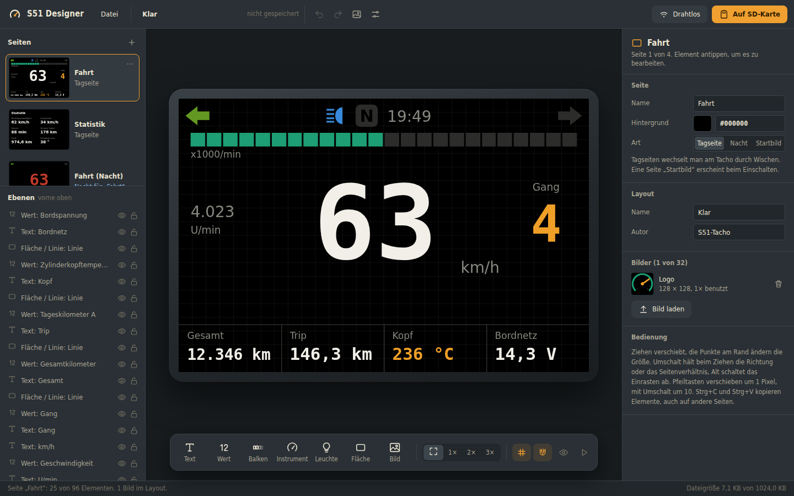
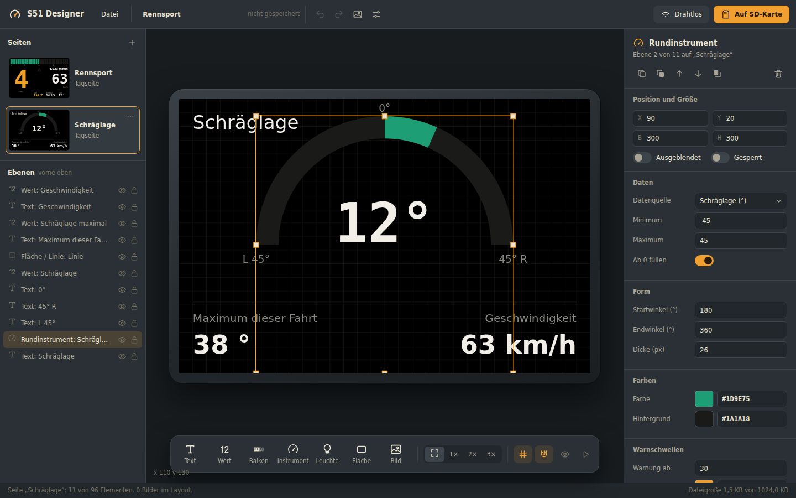
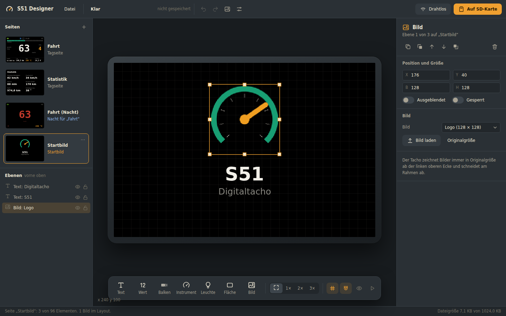
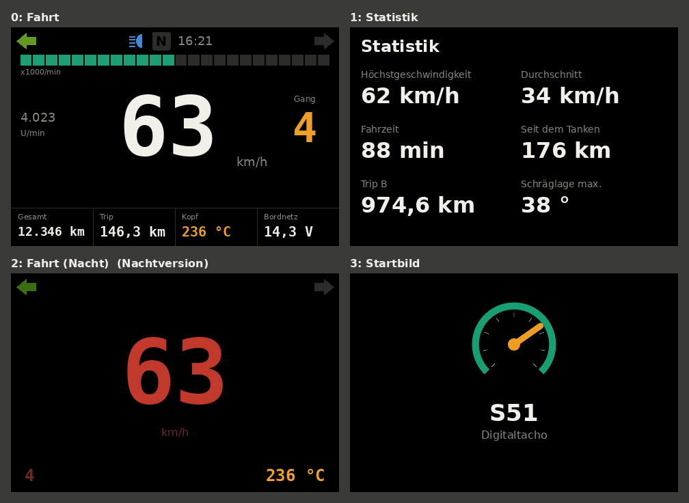
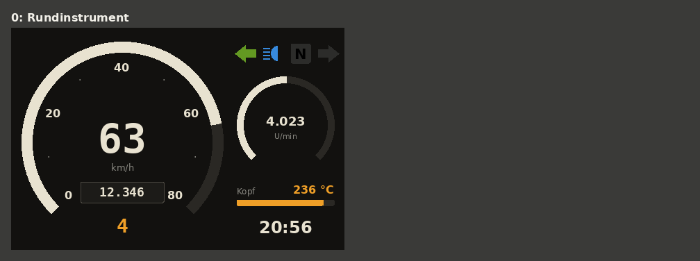
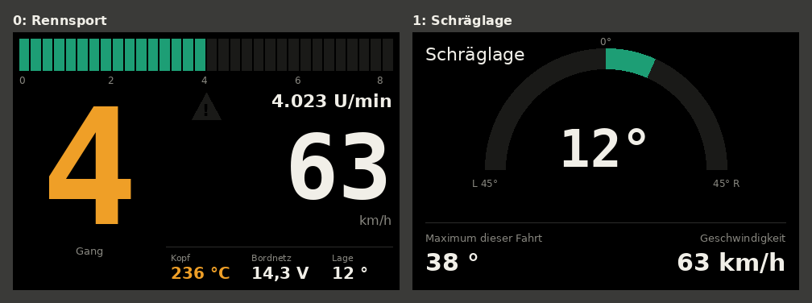
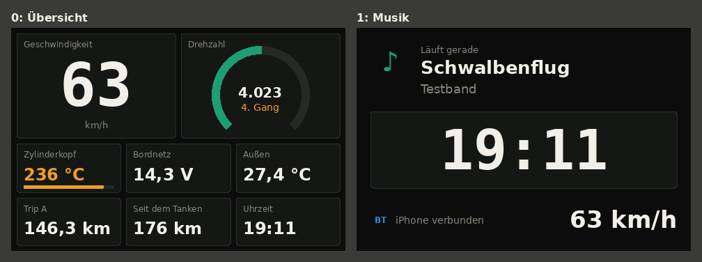
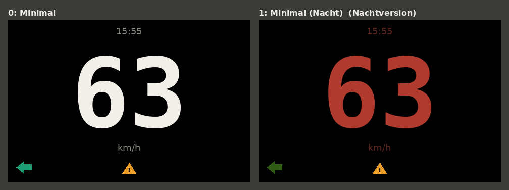
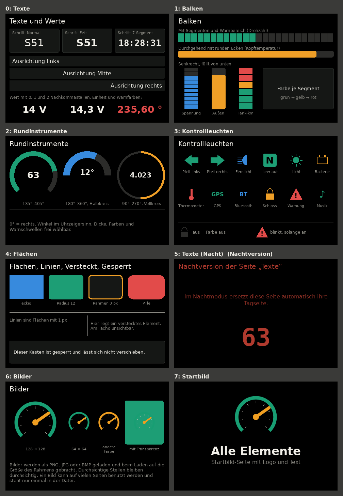

# S51 Designer

PC-Programm zum Gestalten der Tacho-Anzeige. Elemente wie Geschwindigkeit, Drehzahlbalken, Kontrollleuchten oder Texte lassen sich frei auf dem 480 × 320 Pixel großen Display verteilen. Das Ergebnis kommt per SD-Karte oder WLAN auf den Tacho.

Läuft unter Windows, macOS und Linux. Die Oberfläche öffnet sich in einem eigenen Fenster von Microsoft Edge oder Google Chrome (App-Modus, ohne Adressleiste). Edge ist unter Windows 10 und 11 immer vorhanden. Die Anzeige im Designer benutzt dieselben Schriften (DejaVu) und dieselben Regeln wie die Firmware, das Display sieht also aus wie später am Tacho.



## Installieren und starten

### Fertige .exe für Windows

Unter **Releases** auf der GitHub-Seite des Projekts liegt `S51-Designer.exe` zum Herunterladen. Sie läuft ohne installiertes Python. Die exe ist nicht signiert: Bei der Windows-Warnung auf „Weitere Informationen“ und „Trotzdem ausführen“ klicken. Das Programm endet, wenn das Fenster geschlossen wird.

### Aus dem Quelltext

1. **Python 3.9 oder neuer** installieren: https://www.python.org/downloads/ (unter Windows „Add python.exe to PATH“ anhaken). Zusatzpakete braucht der Designer nicht.
2. Repo herunterladen.
3. Starten:
   - **Windows:** Doppelklick auf `designer/S51-Designer.pyw`
   - **Alle Systeme:** im Ordner `designer/` den Befehl `python -m s51design` ausführen

Ohne Edge oder Chrome öffnet sich die Oberfläche im Standard-Browser. Öffnen, Speichern und das Schreiben auf die SD-Karte gehen dann über Herunterladen, die Dateien müssen von Hand an ihren Platz kopiert werden.

`python -m s51design --kein-fenster` startet nur den Server und zeigt die Adresse an, z. B. zum Öffnen in einem anderen Browser.

### Wie es aufgebaut ist

`s51design/webapp.py` startet einen kleinen Webserver, der nur auf diesem Rechner erreichbar ist (127.0.0.1), und öffnet das Fenster. Die Oberfläche liegt in `s51design/web/` (HTML, CSS und JavaScript ohne Zusatzpakete und ohne Build-Schritt). Alles, was mit Dateiformaten zu tun hat, macht weiter Python: Encoder, Decoder, Konfiguration und die Übertragung zum Tacho. Die Adresse enthält ein zufälliges Kennwort, damit andere Webseiten nicht auf den Server zugreifen können.

### exe bauen und veröffentlichen

Die exe wird bei jeder Änderung im Ordner `designer/` automatisch auf GitHub gebaut und getestet (`.github/workflows/designer-release.yml`). Ein Release entsteht, wenn die Versionsnummer neu ist und es Versionshinweise in `designer/release-notes/<Version>.md` gibt:

1. Version in `designer/s51design/__init__.py` erhöhen.
2. `designer/release-notes/<Version>.md` anlegen.
3. Commit auf `main` hochladen. GitHub baut die exe, legt den Tag `designer-v<Version>` an und veröffentlicht den Release.

Selbst bauen: Doppelklick auf `designer/build_exe.bat`. Das lädt PyInstaller und baut `designer/dist/S51-Designer.exe` (mit der Oberfläche aus `s51design/web/` und den Schriften aus `firmware/fonts/`).

## Bedienen

| Bereich | Funktion |
|---|---|
| Oben | **Datei**-Menü (Neu aus Vorlage, Öffnen, Speichern, SD-Karte, Drahtlos, Tacho-Einstellungen), Name des Layouts zum Umbenennen, Rückgängig, Wiederholen, Bild laden, Tacho-Einstellungen. Rechts **Drahtlos** und **Auf SD-Karte** |
| Links oben | **Seiten** mit Miniaturbild. Antippen wechselt die Seite, ziehen ändert die Reihenfolge, „…“ kopiert, verschiebt oder löscht, „+“ legt eine neue Seite an |
| Links unten | **Ebenen:** alle Elemente der Seite, das vorderste oben. Auge blendet am Tacho aus, Schloss sperrt gegen Verschieben |
| Mitte | Das Display im Rahmen. Element anklicken und ziehen, die acht Anfasser ändern die Größe. Beim Ziehen erscheinen rote Hilfslinien an Kanten und Mitten anderer Elemente und des Displays |
| Unten Mitte | **Elemente** zum Antippen oder auf das Display Ziehen: Text, Wert, Balken, Rundinstrument, Kontrollleuchte, Fläche/Linie, Bild. Daneben Zoom (Einpassen, 1×, 2×, 3×) und die Schalter Raster, Einrasten, Vorschau, Demo-Werte |
| Rechts | **Eigenschaften** des gewählten Elements, nach Gruppen (Position und Größe, Daten, Text, Form, Farben, Warnschwellen). Ohne Auswahl: Seite, Layout und Bilder im Layout |
| Unten | Status und Dateigröße des Layouts (höchstens 1 MiB) |



Tastatur:

| Taste | Wirkung |
|---|---|
| Pfeiltasten | Element 1 Pixel verschieben, mit Umschalt 10 Pixel |
| Entf | Element löschen |
| Strg+C / Strg+V | Element kopieren und einfügen, auch auf einer anderen Seite |
| Strg+D | Element duplizieren |
| Strg+Z / Strg+Y | Rückgängig / Wiederholen |
| Strg+N / Strg+O / Strg+S | Neues Design / Öffnen / Speichern (mit Umschalt: Speichern unter) |
| Bild auf / Bild ab | Vorherige / nächste Seite |
| Strg+0, Strg+Mausrad | Einpassen / Zoom |
| Esc | Auswahl aufheben |

Beim Ziehen: **Umschalt** hält die Richtung (verschieben) oder das Seitenverhältnis (Größe an einer Ecke), **Alt** schaltet Einrasten und Hilfslinien ab.

Weitere Hinweise:
- **Einrasten** rastet Position und Größe auf 4 Pixel und an anderen Elementen ein.
- **Vorschau** blendet Auswahl, Raster und ausgeblendete Elemente aus, so wie am Tacho.
- **Demo-Werte** lässt Geschwindigkeit, Drehzahl, Blinker usw. laufen, damit Warnfarben und Balken sichtbar werden.
- **Nachtversion:** Seite anlegen, rechts bei „Art“ auf „Nacht“ stellen und unter „Nacht für“ die Tagseite wählen. Im Nachtmodus zeigt der Tacho dann diese Seite.
- **Ab 0 füllen** (Balken und Rundinstrument): Die Anzeige wächst von der 0 aus nach beiden Seiten, z. B. für die Schräglage von −45 bis 45.
- Farben: Farbfeld anklicken öffnet die Farbauswahl, daneben lässt sich der Wert als `#RRGGBB` eintippen.

### Bilder und Startbild

- **Bild laden** (Symbolleiste oder rechts in den Eigenschaften) liest alle Bildformate, die der Browser kennt: PNG, JPG, BMP, GIF, WebP. Ohne ausgewähltes Bild-Element entsteht ein neues Element in der Mitte. Bilder größer als das Display werden verkleinert. Ist ein Bild-Element ausgewählt, wird das neue Bild genau in dessen Rahmen eingepasst.
- Ein Bild kann von mehreren Elementen benutzt werden. Auswahl im Feld „Bild“ des Elements. **Originalgröße** setzt den Rahmen auf die Größe des Bildes.
- Der Tacho zeichnet Bilder immer in Originalgröße ab der linken oberen Ecke des Rahmens. Durchsichtige Stellen (PNG mit Alpha) bleiben durchsichtig.
- Höchstens 32 Bilder pro Layout, jedes höchstens 480 × 480 Pixel. Gespeichert werden sie mit 65 536 Farben (RGB565), einfarbige Flächen werden komprimiert. Große Fotos machen die Datei schnell groß, die Größe steht unten rechts.
- Ohne Auswahl stehen rechts alle Bilder des Layouts mit Vorschau und wie oft sie benutzt werden. Dort lassen sie sich auch löschen.
- **Startbild:** Eine Seite bei „Art“ auf „Startbild“ stellen. Diese Seite zeigt der Tacho beim Einschalten, so lange wie in den Tacho-Einstellungen unter `anzeige.startbild_dauer_s` eingestellt. Ein Layout hat höchstens eine Startbild-Seite.



## Vorlagen

Sechs Layouts sind eingebaut (Datei → Neues Design, oder Strg+N) und liegen auch als Dateien in `beispiele/`. Sie zeigen, was der Designer kann, und sind ein guter Startpunkt für eigene Layouts.

| Vorlage | Inhalt |
|---|---|
| **Klar** | Standard-Layout des Tachos: große Geschwindigkeit, Drehzahlbalken, Infozeile, Statistikseite, Nachtversion, Startbild mit Logo |
| **Retro** | Rundinstrument im Stil des alten Simson-Tachos mit Skala, Kilometerzähler und kleinem Drehzahlmesser |
| **Rennsport** | Riesige Ganganzeige, segmentierter Drehzahlbalken mit rotem Bereich, Schaltblitz, Seite für die Schräglage |
| **Cockpit** | Viele Werte in Kacheln, Drehzahl als Ring, dazu eine Musikseite mit Songtitel vom iPhone |
| **Minimal** | Nur Geschwindigkeit, Uhrzeit, Blinker und Warnsymbol, mit gedimmter Nachtversion |
| **Alle Elemente** | Eine Seite je Element-Typ: Schriften und Ausrichtung, Balkenarten, Rundinstrumente mit verschiedenen Winkeln, alle Symbole, Flächen und Linien, versteckte und gesperrte Elemente, Nachtversion, Bilder, Startbild |








Die Bilder zeigen die Vorschau mit Demo-Werten. Neu erzeugen mit `python tools/make_examples.py` (braucht Pillow: `pip install pillow`).

## Auf den Tacho bringen

**SD-Karte:** Knopf **Auf SD-Karte** (oder Datei → Auf SD-Karte schreiben), dann das Laufwerk der Karte wählen. Der Browser fragt einmal, ob der Designer auf diesen Ordner schreiben darf. Im folgenden Fenster:
- **Speichern als:** Dateiname des Designs, vorgeschlagen aus dem Layout-Namen (z. B. `klar.s51`). Andere Designs auf der Karte bleiben erhalten, so lassen sich mehrere nebeneinander ablegen.
- **Standard-Design beim Start:** welches der Designs auf der Karte der Tacho beim Start zeigt. Wird in der `tacho.cfg` als `layout_datei` gespeichert. Ohne Haken bei „speichern als“ ändert der Dialog nur das Standard-Design.
- Die übrigen Einstellungen in einer vorhandenen `tacho.cfg` bleiben erhalten. Nur wenn im Designer Einstellungen geladen oder bearbeitet wurden, werden diese geschrieben.

Am Tacho lässt sich durch langes Drücken auf das Display jederzeit ein anderes Design wählen ([firmware/README.md](../firmware/README.md)). Ein im Designer neu festgelegtes Standard-Design gilt beim nächsten Start.

**WLAN:** Knopf **Drahtlos**. Ablauf und Protokoll: [docs/uebertragung.md](../docs/uebertragung.md).

**Einstellungen** (Radumfang, Warnschwellen, Alarm, WLAN …): Symbol mit den Reglern oben oder Datei → Tacho-Einstellungen. Dort lässt sich auch eine vorhandene `tacho.cfg` laden oder als Datei speichern. Erklärung aller Werte: [docs/konfiguration.md](../docs/konfiguration.md).

## Dateien

| Datei | Inhalt | Beschreibung |
|---|---|---|
| `*.s51` | Layout (binär) | [docs/dateiformat-layout.md](../docs/dateiformat-layout.md) |
| `tacho.cfg` | Einstellungen (Text) | [docs/konfiguration.md](../docs/konfiguration.md) |
| `beispiele/*.s51` | Mitgelieferte Layouts, siehe Vorlagen | |

Die `.s51`-Datei ist zugleich die Projektdatei. Es gibt kein separates Projektformat.

## Kommandozeile

Für Fehlersuche und Automatisierung, im Ordner `designer/`:

```
python -m s51design.cli decode datei.s51            # Layout als JSON anzeigen
python -m s51design.cli encode layout.json datei.s51 # JSON -> .s51
python -m s51design.cli check datei.s51             # nur prüfen
python -m s51design.cli preset Klar datei.s51       # mitgeliefertes Layout schreiben
python -m s51design.cli config-check tacho.cfg      # Konfiguration prüfen
python -m s51design.cli config-new tacho.cfg        # Vorlage mit allen Einträgen
python -m s51design.cli sd datei.s51 E:\            # Design auf die SD-Karte, wird Standard-Design
python -m s51design.cli sd datei.s51 E:\ --standard klar.s51   # Standard-Design anders wählen
```

## Aufbau des Codes

| Datei | Aufgabe |
|---|---|
| `s51design/schema.py` | **Einzige Quelle** aller Nummern (Element-Typen, Datenquellen, Eigenschaften, Konfiguration) |
| `s51design/layout_format.py` | Encoder und Decoder für `.s51` |
| `s51design/config_format.py` | Lesen und Schreiben von `tacho.cfg` |
| `s51design/transfer.py` | WLAN-Übertragung |
| `s51design/mock_tacho.py` | Simulierter Tacho zum Testen der Übertragung |
| `s51design/values.py` | Demo-Werte und Anzeigeregeln (Zahlenformat, Warnfarben) |
| `s51design/render.py` | Zeichnen der Vorschaubilder (`tools/preview_png.py`) |
| `s51design/images.py` | Bilder: Umrechnung nach RGB565, Komprimierung, Größe ändern, PNG lesen und schreiben, mitgeliefertes Logo |
| `s51design/sdcard.py` | Designs auf die SD-Karte schreiben (Kommandozeile `sd`) |
| `s51design/webapp.py` | Server der Oberfläche und Start des Fensters |
| `s51design/web/` | Oberfläche: `index.html`, `css/app.css`, `js/` (siehe unten), Schrift der Bedienung in `fonts/` |
| `s51design/presets.py` | Mitgelieferte Layouts |
| `tools/gen_cpp_header.py` | Erzeugt den C++-Teil des Schemas für die Firmware |
| `tools/preview_png.py` | Vorschaubilder von Layouts als PNG, ohne Fenster (braucht Pillow) |
| `tools/make_examples.py` | Schreibt alle Vorlagen nach `beispiele/` und ihre Bilder nach `docs/bilder/` |
| `tools/ui_screenshots.mjs` | Bildschirmfotos der Oberfläche nach `docs/bilder/designer/` (Node.js mit playwright-core und Chrome) |

Die Oberfläche in `s51design/web/js/`:

| Datei | Aufgabe |
|---|---|
| `main.js` | Start, Kopfleiste, Element-Leiste, Tastatur, Verteilen von Änderungen |
| `model.js` | Das offene Layout, Auswahl, Rückgängig (wie früher `editor.py`) |
| `render.js` | Zeichnen auf dem Display nach denselben Regeln wie `values.py` und die Firmware |
| `stage.js` | Display mit Auswahl, Ziehen, Größe, Hilfslinien, Zoom |
| `panels.js`, `inspector.js` | Seiten und Ebenen links, Eigenschaften rechts |
| `dialogs.js`, `files.js` | Vorlagen, Bilder, SD-Karte, Einstellungen, Drahtlos, Öffnen und Speichern |
| `schema.js`, `api.js`, `ui.js`, `icons.js` | Schema vom Server, Verbindung zum Server, Bausteine, eigene Symbole |

## Tests

```
cd designer
python -m unittest discover -s tests -v
```

Die Tests prüfen:
- Encoder und Decoder in beide Richtungen, auch mit beschädigten Dateien
- Konfiguration lesen und schreiben, auch mit Fehlern in der Datei
- Übertragung gegen den simulierten Tacho
- dass der C++-Decoder der Firmware genau dasselbe liest wie der Python-Decoder (braucht `g++`, sonst übersprungen)
- dass der erzeugte C++-Header zum Schema passt
- dass die Doku alle Nummern und Schlüssel enthält
- den Server der Oberfläche: Kennwort, Dateien, alle Anfragen, Übertragung gegen den simulierten Tacho
- dass Oberfläche (JavaScript, braucht Node.js), Vorschau (Python) und Firmware (C++) Werte, Warnfarben, Balken und Kontrollleuchten gleich anzeigen
- Schreiben auf die SD-Karte

Was die Tests **nicht** abdecken: wie die Oberfläche aussieht und wie sie sich bedienen lässt. Dafür startet `tools/ui_screenshots.mjs` die Oberfläche in Chrome, klickt sich durch und macht Bildschirmfotos. Meldet die Seite dabei einen Fehler, schlägt es fehl. Auf GitHub: Actions → „Designer-Bildschirmfotos“ → Run workflow. Beim Bauen der exe prüft GitHub außerdem, dass die exe startet und Oberfläche und Schriften enthält.
