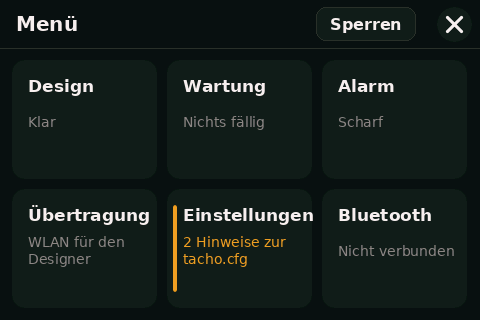
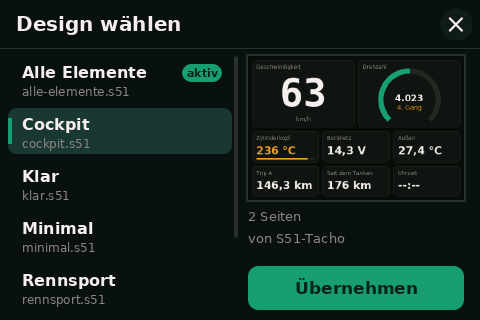
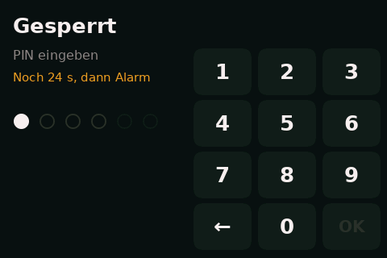
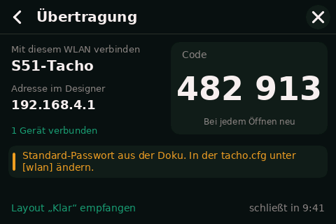
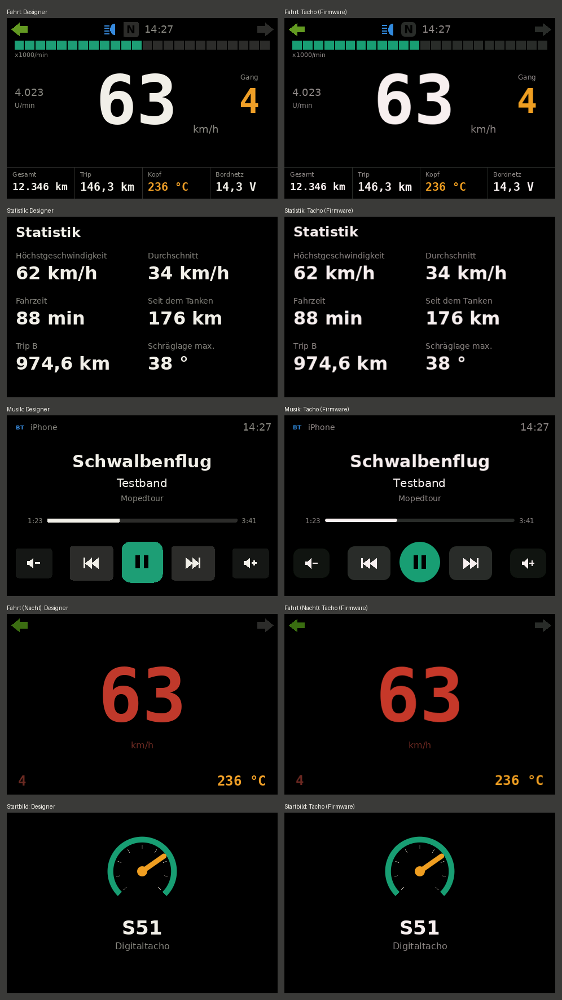

# Firmware

PlatformIO-Projekt für das WT32-SC01 Plus (ESP32-S3, 16 MB Flash, 2 MB PSRAM). Pins: `include/pins.h`, Display-Treiber: `include/lgfx_sc01plus.h`.

Aktueller Stand: **Phase 2**, der Tacho zeigt Layouts aus dem [S51 Designer](../designer/README.md) an und hat die fest eingebauten Menüs, den Sperrbildschirm mit PIN, die WLAN-Übertragung und Musik per Bluetooth. Fast alle Werte sind noch Demo-Werte (wie in der Vorschau des Designers), Sensoren kommen ab Phase 3. Echt sind schon „Alarm scharf“, „Kilometer bis Wartung“, alle Musik-Quellen, „Handy verbunden“ und die Uhrzeit vom iPhone. Was davon auf dem Display getestet ist, steht in der Statustabelle der [README](../README.md).

## Bedienung

**Designs auf die SD-Karte bringen:** microSD-Karte (FAT32, bis 32 GB) am PC einlegen, im Designer **Auf SD-Karte** wählen. Der Designer schreibt das Design als `<name>.s51` in den Ordner `s51` und legt in der `tacho.cfg` fest, welches Design beim Start gilt (Standard-Design). So lassen sich beliebig viele Designs auf die Karte legen. Karte in den Slot des Displays stecken und den Tacho neu starten.

**Beim Start**
1. `s51/tacho.cfg` wird gelesen. Fehlt sie, gelten die Standardwerte ([docs/konfiguration.md](../docs/konfiguration.md)).
2. Das Design wird gewählt: am Tacho ausgewähltes Design, sonst das Standard-Design aus `layout_datei`, sonst die erste `.s51`-Datei, sonst die interne Kopie, sonst das eingebaute Layout „Klar“. Genaue Regeln: [docs/dateiformat-layout.md](../docs/dateiformat-layout.md), Abschnitt 7.
3. Hat das Layout eine Startbild-Seite, erscheint sie für `startbild_dauer_s` Sekunden, sonst `startbild_text`.
4. Ist Sicherheitsstufe 2 eingestellt, der Alarm an und eine PIN festgelegt, erscheint der Sperrbildschirm (siehe unten). Bis die Zündung angeschlossen ist (Phase 5), gilt jeder Start als „Zündung an“.
5. Danach die Tagseite aus `startseite`. Unten erscheinen einige Sekunden lang Hinweise, z. B. „Keine SD-Karte“ oder „Wartung fällig: Zündkerze“.

**Seite wechseln:** nach links oder rechts wischen oder auf das rechte bzw. linke Drittel tippen. Unten zeigen Punkte kurz, auf welcher Seite man ist.

**Tasten im Layout:** Ein Element vom Typ „Taste“ löst beim Antippen seine Aktion aus (Musik, Seite, Menü, Nachtmodus, Sperren). Solange der Finger darauf liegt, ist die Taste heller. Ein Wischen, das auf einer Taste beginnt, wechselt trotzdem die Seite. Der mit einer Taste umgeschaltete Nachtmodus gilt bis zum Ausschalten. „Trip zurücksetzen“ meldet bis Phase 4 nur, dass die Tageskilometer mit GPS kommen.

**Musik per Bluetooth**
- Ist `[bluetooth] aktiv = ja` (Standard), ist der Tacho unter dem Namen aus `name` (Standard „S51-Tacho“) sichtbar. Am Handy unter Einstellungen → Bluetooth antippen und koppeln, ohne PIN. Danach verbindet sich das Handy bei jedem Start von selbst.
- iPhone und Android: Abspielen/Pause, nächster und voriger Titel, lauter und leiser über die Tasten im Layout (später auch über die Lenkertaster).
- Nur iPhone: Titel, Interpret, Album, Position, Länge und Lautstärke für die Anzeige, dazu die Uhrzeit. Die Befehle gehen beim iPhone direkt an die Musik-App, die gerade spielt.
- Buchstaben, die die eingebauten Schriften nicht haben, werden ersetzt: Akzente fallen weg (é → e), Emojis entfallen, andere Schriften (z. B. Kyrillisch) erscheinen als „?“.
- Menü → Bluetooth zeigt das verbundene Handy und den Titel, mit Knopf Abspielen/Pause zum Testen. „Vergessen“ löscht alle Kopplungen. Danach am Handy den alten Eintrag „S51-Tacho“ ebenfalls entfernen und neu koppeln.
- Mit `aktiv = nein` bleibt Bluetooth ganz aus. Die Musik-Quellen sind dann leer.

**Menü:** etwa eine Sekunde lang auf das Display drücken. Das × oben rechts schließt das Menü, der Pfeil oben links geht eine Seite zurück. Längere Listen lassen sich nach oben und unten wischen.



| Kachel | Inhalt |
|---|---|
| Design | Auswahl aller Designs, siehe unten |
| Bluetooth | Verbundenes Handy, laufender Titel, gekoppelte Handys vergessen (siehe oben) |
| Wartung | Kilometerstand und die Erinnerungen aus `[wartung]` der `tacho.cfg`. „Erledigt“ startet den Abstand beim jetzigen Kilometerstand neu. Ein roter Strich an der Kachel zeigt eine fällige Erinnerung |
| Alarm | Bewegungsalarm scharf oder aus, Sicherheitsstufe (aus der `tacho.cfg`), PIN festlegen, ändern oder entfernen, NFC-Tag anlernen (folgt später), Protokoll |
| Übertragung | WLAN für den Designer, siehe unten |
| Einstellungen | Gänge anlernen (folgt mit GPS und Drehzahl), Hinweise zur `tacho.cfg` mit Zeilennummer, Angaben zu Firmware, Design und Speicher |
| Knopf „Sperren“ oben | Sperrbildschirm sofort zeigen, ohne Zeitlimit. Erscheint nur mit festgelegter PIN |

Der Kilometerstand zählt ab Phase 4 (GPS). Bis dahin steht er auf 0, Wartung und „Kilometer bis Wartung“ funktionieren aber schon.

**Design wählen:** Menü → Design. Links stehen alle Designs von der SD-Karte und das eingebaute „Klar“, rechts eine Vorschau des angetippten Designs. „Übernehmen“ wechselt sofort, der Tacho merkt sich die Wahl auch nach dem Ausschalten. Mehr Designs als auf den Bildschirm passen: in der Liste nach oben oder unten wischen. Das × oben rechts schließt die Auswahl.



**PIN und Sperrbildschirm** ([docs/bauplan.md](../docs/bauplan.md), Abschnitt 4.4)
- PIN festlegen: Menü → Alarm → PIN festlegen, 4 bis 6 Ziffern, zur Sicherheit zweimal. Ändern und Entfernen fragen zuerst die alte PIN ab.
- Die PIN liegt nur im internen Speicher (NVS), als SHA-256-Prüfwert mit Zufallssalz, nie auf der SD-Karte. Per WLAN lässt sie sich weder lesen noch setzen.
- Mit Sicherheitsstufe 2 (`[alarm] stufe = 2`) und eingeschaltetem Alarm erscheint nach dem Einschalten der Sperrbildschirm. Ohne richtige PIN innerhalb von `entsperrzeit_s` Sekunden wird Alarm ausgelöst. Die PIN beendet ihn.
- Nach 3 falschen PINs: 1 Minute keine Eingabe möglich und Alarm. Das gilt auch nach einem Neustart weiter.
- Jeder Alarm, jede PIN-Änderung und jedes Ein- und Ausschalten des Alarms landet im Protokoll (Menü → Alarm → Protokoll, höchstens 50 Einträge). Bis GPS oder iPhone die Uhrzeit liefern, steht dort die Nummer des Starts und die Zeit seit dem Einschalten.
- Der Alarmton kommt mit Phase 5. Bis dahin zeigt der Sperrbildschirm den Alarm nur an.
- Der Schalter „Bewegungsalarm“ im Menü gilt, solange `alarm.aktiv` in der `tacho.cfg` gleich bleibt. Wird dort ein anderer Wert eingetragen, gilt dieser.



**PIN vergessen:** Den internen Speicher löschen und die Firmware neu aufspielen, z. B. mit esptool: `python -m esptool --chip esp32s3 erase_flash`, danach wie unten flashen. Dabei gehen auch Kilometerstand, Wartung, Protokoll und die Design-Auswahl verloren. Designs und `tacho.cfg` auf der SD-Karte bleiben.

**Drahtlos übertragen:** Menü → Übertragung schaltet das WLAN ein und zeigt Netzwerk, Adresse und einen 6-stelligen Code. Im Designer *Datei → Drahtlos übertragen* Adresse und Code eingeben. Ein empfangenes Design speichert der Tacho als `s51/<name>.s51` (gleicher Dateiname wie beim Export auf die SD-Karte), zeigt es sofort an und merkt es sich als gewähltes Design. Ohne SD-Karte landet es nur in der internen Kopie. Eine empfangene `tacho.cfg` gilt sofort, die WLAN-Einstellungen daraus beim nächsten Öffnen. Das WLAN geht aus, sobald die Seite verlassen wird, spätestens nach 10 Minuten. Protokoll und Sicherheit: [docs/uebertragung.md](../docs/uebertragung.md).



**Nachtmodus:** `nachtmodus = an` in der `tacho.cfg` zeigt die Nachtversionen der Seiten und nutzt `helligkeit_nacht`. `auto` verhält sich bis Phase 3 wie `aus`.

**Uhrzeit:** zeigt „--:--“, bis GPS oder iPhone die Zeit liefern (Phase 4).

Die serielle Ausgabe (115200 Baud) zeigt, was beim Start gelesen wurde, auch Hinweise zur `tacho.cfg` mit Zeilennummer.

## Flashen ohne PlatformIO

Jeder Release unter **Releases** (Tag `firmware-v…`) enthält zwei Dateien:

| Datei | Inhalt | Adresse |
|---|---|---|
| `s51-tacho-<Version>-komplett.bin` | Bootloader, Partitionstabelle und Programm in einer Datei | `0x0` |
| `s51-tacho-<Version>-app.bin` | nur das Programm, für Updates | `0x10000` |

Am einfachsten im Browser (Chrome oder Edge am PC, Web Serial):

1. Display mit einem USB-C-**Datenkabel** an den PC anschließen. Reine Ladekabel funktionieren nicht.
2. https://espressif.github.io/esptool-js/ öffnen (offizielles Werkzeug von Espressif).
3. Baudrate 921600, auf **Connect** klicken und den Port wählen (Windows: „USB JTAG/serial debug unit“ oder „USB-Serial-Gerät (COMx)“).
4. Unter „Flash Address“ `0x0` eintragen, die Datei `…-komplett.bin` wählen, **Program** klicken.
5. Nach „Leaving…“ das Kabel kurz abziehen und wieder einstecken. Das Display zeigt „S51“ und die Versionsnummer.

Mit esptool auf der Kommandozeile:

```
python -m pip install esptool
python -m esptool --chip esp32s3 write_flash 0x0 s51-tacho-0.1.0-komplett.bin
```

Klappt die Verbindung nicht: anderes USB-C-Kabel oder anderen USB-Anschluss probieren und die Baudrate auf 115200 senken. Erscheint gar kein Port: Am Debug-Stecker (7-polig, MX1.25) Pin 6 (BOOT/GPIO 0) mit Pin 7 (GND) verbinden, Reset-Taste drücken, Verbindung lösen und erneut verbinden.

## Selbst bauen

```
cd firmware
pio run              # bauen
pio run -t upload    # bauen und über USB-C flashen
pio device monitor   # serielle Ausgabe, 115200 Baud
```

Alle Versionen sind in `platformio.ini` fest gepinnt. GitHub baut die Firmware bei jeder Änderung in `firmware/` (`.github/workflows/firmware-release.yml`).

## Neue Version veröffentlichen

1. `FW_VERSION` in `include/version.h` erhöhen.
2. `release-notes/<Version>.md` anlegen.
3. Commit auf `main` hochladen. GitHub baut die Dateien und legt den Release `firmware-v<Version>` an.

## Aufbau

| Pfad | Inhalt |
|---|---|
| `src/main.cpp` | Ablauf: SD-Karte, Konfiguration, Design wählen und laden, Startbild, Sperre, Seitenwechsel, Bedienung. Speichert PIN, Wartung, Protokoll und Auswahl, beantwortet Anfragen vom Designer |
| `src/transfer.cpp` | WLAN (Hotspot oder Heimnetz) und HTTP-Gegenstelle nach [docs/uebertragung.md](../docs/uebertragung.md) |
| `src/bluetooth.cpp` | Bluetooth LE mit NimBLE: Fernbedienung (HID), Apple Media Service, Uhrzeit vom iPhone |
| `lib/s51media/` | Auswerten der Musik- und Uhrzeitdaten vom Handy, Anpassen der Texte an die Schriften |
| `include/pins.h` | Alle Pins |
| `include/lgfx_sc01plus.h` | Display- und Touch-Einstellungen für LovyanGFX |
| `lib/s51layout/` | Decoder für Layout (`.s51`) und Konfiguration (`tacho.cfg`), Dateiname für empfangene Designs (`s51_filename`) |
| `lib/s51render/` | Zeichnet Seiten: Regeln für Werte und Warnfarben (`s51_values`), Schrift (`s51_text`), Elemente (`s51_render`) |
| `lib/s51ui/` | Fest eingebaute Bildschirme: Design-Auswahl (`s51_picker`), Menüs, PIN-Eingabe und Sperrbildschirm (`s51_menu`) |
| `data/s51fonts.bin` | Schriften, erzeugt von `tools/gen_fonts.py` aus `fonts/` |
| `data/klar.s51` | Eingebautes Layout, geschrieben von `designer/tools/make_examples.py` |
| `fonts/` | DejaVu-Schriften mit Lizenz |
| `hosttest/` | Programme, die den Code der Firmware am PC laufen lassen |

## Am PC prüfen

Die Bibliotheken in `lib/` laufen auch am PC:

- `designer/tests/test_cpp_decoder.py` vergleicht den Decoder mit dem Python-Decoder des Designers.
- `designer/tests/test_firmware_render.py` vergleicht Werteformat, Warnfarben, Balken und Kontrollleuchten mit den Regeln des Designers und prüft, dass die Schriften alle Zeichen der Vorlagen enthalten.
- `hosttest/ui.sh <Zielordner>` zeichnet die Design-Auswahl mit allen Vorlagen als Designs.
- `hosttest/menu.sh <Zielordner>` spielt die Menüs mit einem simulierten Tacho durch (PIN festlegen, sperren, 3 falsche PINs, Wartung bestätigen, Protokoll leeren, Übertragung öffnen) und zeichnet jede Seite. Endet mit Fehler, wenn ein Ablauf nicht stimmt. Bilder: [docs/bilder/firmware/](../docs/bilder/firmware/) (`menue-*.png`).
- `designer/tests/test_firmware_render.py` prüft außerdem, dass ein per WLAN empfangenes Design denselben Dateinamen bekommt wie beim Export im Designer.
- `designer/tests/test_firmware_media.py` spielt Nachrichten eines iPhones durch (Titel, Position, Pause, Uhrzeit über Mitternacht, Sonderzeichen) und prüft, was die Firmware daraus anzeigt (`hosttest/media_main.cpp`).
- `hosttest/compare.py` zeichnet alle Vorlagen mit dem echten Renderer (LovyanGFX am PC, ohne Display) und stellt sie neben die Vorschau des Designers. Ergebnis: [docs/bilder/firmware/](../docs/bilder/firmware/). Braucht g++, git und Pillow:

```
cd firmware
python hosttest/compare.py /tmp/vergleich
```



## Schriften neu erzeugen

```
cd firmware
python tools/gen_fonts.py
```

Welche Größen und Zeichen enthalten sind, steht oben in `tools/gen_fonts.py`. Bis 22 px gibt es jede Größe, darüber wird aus der nächstgrößeren Schrift heruntergerechnet. Ab 64 px gibt es nur Ziffern und Zahlzeichen (Geschwindigkeit, Gang, Uhrzeit).
